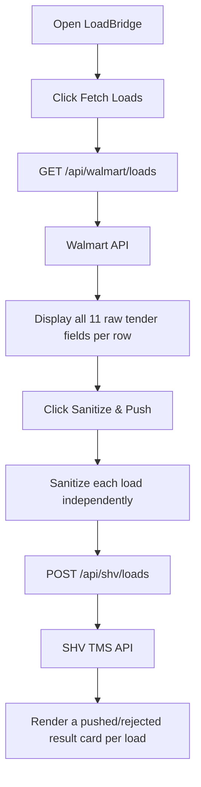
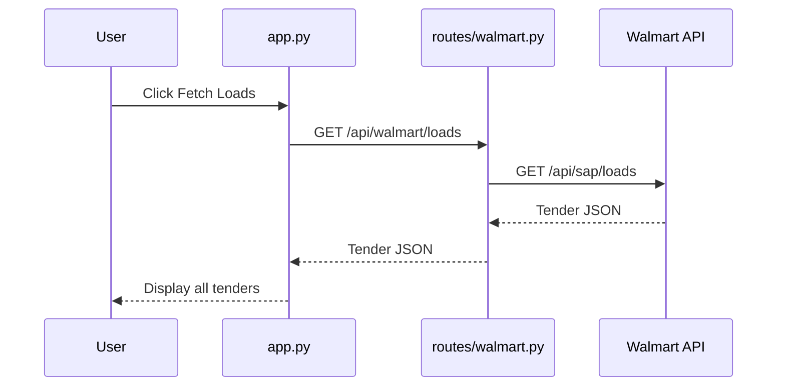
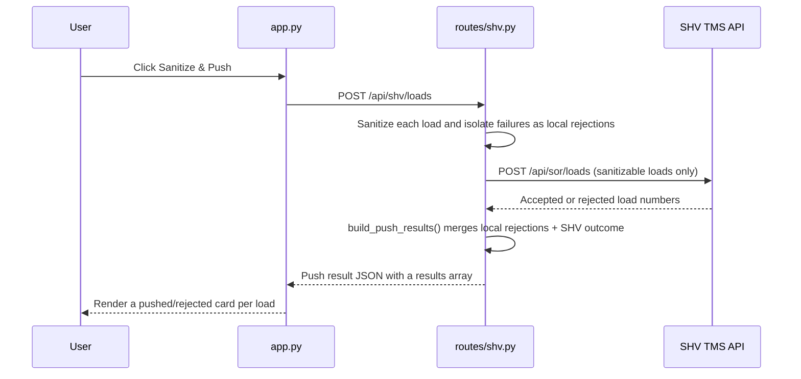

# Application Flow

This document shows how the user operates the app and how each button communicates with the external APIs.

## Main User Flow

## Fetch Loads

## Sanitize and Push

The push step will apply the documented transformations, one load at a time:

- Convert Walmart dates to the SHV date format.
- Remove commas and the `lbs` label from weight.
- Map known Walmart modes to SHV equipment types (unmapped modes become `Contact Operator`).
- If a single load fails sanitization (bad date, unparsable weight, malformed record), it is recorded as a local rejection and excluded from the SHV request — it does not block the other loads in the batch.
- Send the remaining sanitized loads to the SHV API in one request.
- Combine the local rejections with the SHV accepted/rejected outcome into one `results` list, one entry per original load.
- Render a result card per load: a `Pushed` or `Rejected` badge, the load number, the exact JSON payload sent to SHV, and any validation errors.

